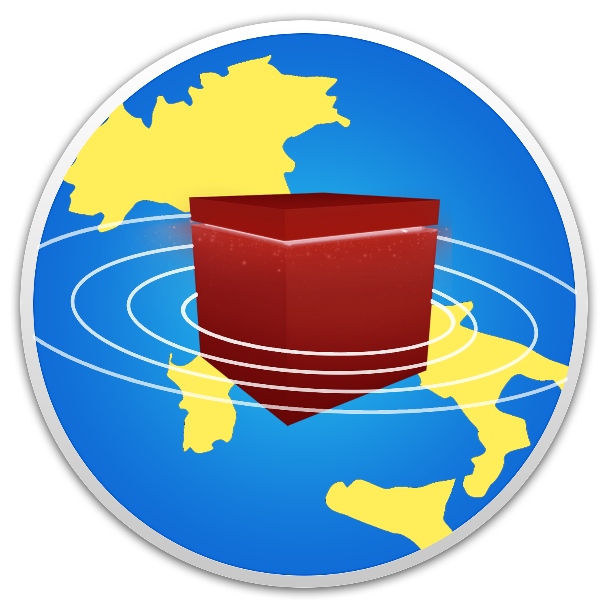

# Visual Earthquakes
[](https://travis-ci.org/Epoes/Earthquakes-Analytics-and-Prediction)&nbsp;
<div align="center">
	
	<div align="center">
		<a href="http://reveal.inf.usi.ch/">
			
		</a>
		<a href="http://www.inf.usi.ch/">
			
		</a>
	</div>
</div>	


# Visual Earthquakes in a nutshell 
<p>
Earthquakes are a major issue in Italy with an average of 2000 earthquakes per year. The “Istituto Nazionale di Geofisica e Vulcanologia” (INGV) provides a huge dataset containing all the information about earthquakes occurred in Italy since 1985. The problem with the provided data is that they are static and disaggregate, and the INGV service does not provide any dynamic visualization.
</p>
<p>
We propose as a solution Visual Earthquakes, a Web Application which provides an interactive and dynamic way of visualizing earthquakes in a 3D environment modeled with voxels. It offers the visualization of hypocenters and also shows the arrival order of the seismic waves to the seismographic stations and their propagation.
</p>
<p>
We illustrate with some use cases how the visualization of hypocenters works and how the user can visualize the propagation of earthquakes through the terrain.
</p>

# Use It
If you just want to play and interact with Visual Earthquakes, you can see the newest version of it [here](rio.inf.usi.ch:38090/visual-earthquakes).

# Start it on your machine 
If you have more time, you can run it on your machine using the following instructions.

<b> Since the program needs seed the database for all the earthquakes and for the 3D model of Italy, to complete these steps, it may take some days (due to the limited requests per day of Google Maps)</b> 

# Setup instructions
Prerequisites:
- Newest version of Java installed
- MySQL installed
If you already have it, create a database named `DATABASE_NAME'. Otherwise set an username `USER_DB' and a password `PSWRD_DB' and then create the databes.
- Generate a Google Maps Key on [https://console.developers.google.com](https://console.developers.google.com) (we will refer to it as GOOGLEKEY later).
Then:
- Download the repository as a zip.
- Unzip the directory.

# Start the application
Go in the unzipped directory and then run the following comands on the terminal
```bash
mvn clean install
cd target
java -jar demo-0.0.1-SNAPSHOT.jar --dbUrl="jdbc:mysql://localhost:3306/NAMEOFDATABASE" --dbUser="USERNAME_DB" --dbPassword="PASSWORD_DB" --GoogleKey="GOOGLEKEY" 
```

After the last command listed has been executed, the server will start.
Now open your browser and go to [localhost:8080/visual-earthquakes](localhost:8080).

# Credits 
Developed by Leonardo Iandiorio
